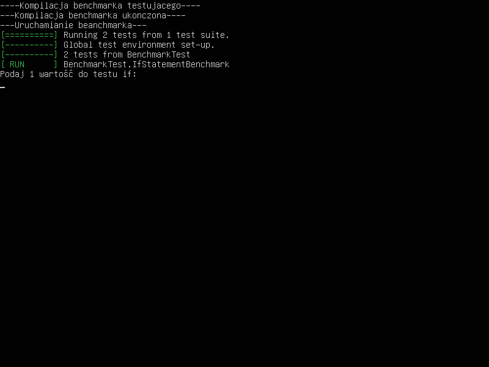
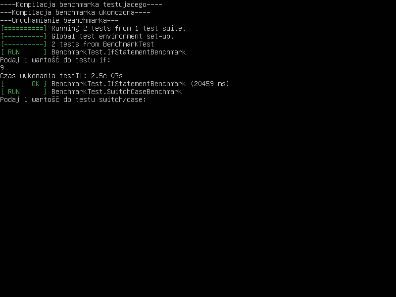
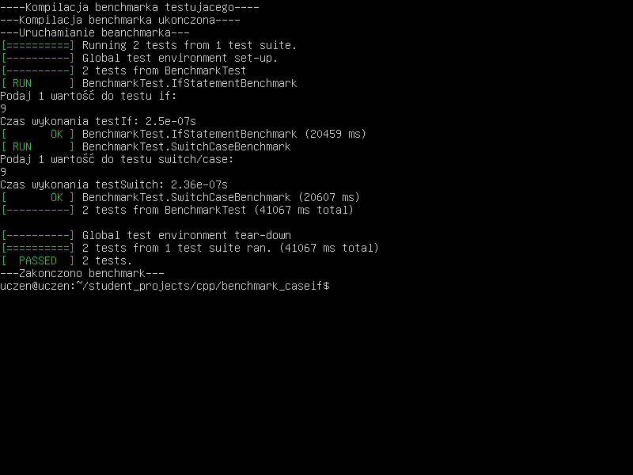

# Benchmark porównanie quicksort i bubble
#### Lista funkcji 
                
+ Funkcja if.
    + Zwykły "if" który sprawdza wybraną przez nas liczbę.

```cpp

void testIf(int value, const std::vector<int>& values) {
    if (value == values[0]) {}
    else if (value == values[1]) {}
    else if (value == values[2]) {}
    else if (value == values[3]) {}
    else if (value == values[4]) {}
    else if (value == values[5]) {}
    else if (value == values[6]) {}
    else if (value == values[7]) {}
    else if (value == values[8]) {}
    else if (value == values[9]) {}
}
```
+ Funkcja case.
    + Również zwykły "case" który sprawdza wybraną przez nas liczbę.

```cpp
void testSwitch(int value, const std::vector<int>& values) {
    switch (value) {
        case 0: break;
        case 1: break;
        case 2: break;
        case 3: break;
        case 4: break;
        case 5: break;
        case 6: break;
        case 7: break;
        case 8: break;
        case 9: break;
        default: break;
    }
}
```
+ Funkcja króra sprawdza czy wektor na pewno jest posortowany.

```cpp
  bool isSorted(const std::vector<int>& vec) {
      for (size_t i = 1; i < vec.size(); i++) {
          if (vec[i - 1] > vec[i]) return false;
      }
      return true;
  }
```
+ Przeprowadzane są testy obu funkcji oraz wprowadzane są dla nich wartości.
  + If.

```cpp
TEST(BenchmarkTest, IfStatementBenchmark) {
    std::srand(std::time(0));

    // Pobranie wartości od użytkownika
    std::vector<int> userValues(1);
    std::cout << "Podaj 1 wartość do testu if: \n";
    for (int& val : userValues) {
        std::cin >> val;
    }

    for (int i = 0; i < 10000; i++) {
        int randomValue = std::rand() % 10;

        auto start = std::chrono::high_resolution_clock::now();
        testIf(randomValue, userValues);
        auto end = std::chrono::high_resolution_clock::now();

        std::chrono::duration<double> elapsed_seconds = end - start;
        if (i == 0) { // Print time for the first test only.
            std::cout << "Czas wykonania testIf: " << elapsed_seconds.count() << "s\n";
        }
    }
}
```

  + Case.

```cpp
TEST(BenchmarkTest, SwitchCaseBenchmark) {
    std::srand(std::time(0));

    // Pobranie wartości od użytkownika
    std::vector<int> userValues(1);
    std::cout << "Podaj 1 wartość do testu switch/case: \n";
    for (int& val : userValues) {
        std::cin >> val;
    }

    for (int i = 0; i < 10000; i++) {
        int randomValue = std::rand() % 10;

        auto start = std::chrono::high_resolution_clock::now();
        testSwitch(randomValue, userValues);
        auto end = std::chrono::high_resolution_clock::now();

        std::chrono::duration<double> elapsed_seconds = end - start;
        if (i == 0) { // Print time for the first test only.
            std::cout << "Czas wykonania testSwitch: " << elapsed_seconds.count() << "s\n";
        }
    }
}
```

+ Przykład wykonanego kodu



Jak widzimy, if wykonuje się marginalnie szybciej.
