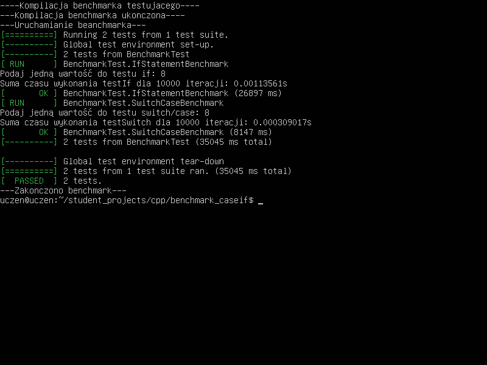

# Benchmark porównanie if i case
#### Lista funkcji 
                
+ Funkcja if.
    + Zwykły "if" który sprawdza wybraną przez nas liczbę.

```cpp

void testIf(int value, const std::vector<int>& values) {
    if (value == values[0]) {}
    else if (value == values[1]) {}
    else if (value == values[2]) {}
    else if (value == values[3]) {}
    else if (value == values[4]) {}
    else if (value == values[5]) {}
    else if (value == values[6]) {}
    else if (value == values[7]) {}
    else if (value == values[8]) {}
    else if (value == values[9]) {}
}
```
+ Funkcja case.
    + Również zwykły "case" który sprawdza wybraną przez nas liczbę.

```cpp
void testSwitch(int value, const std::vector<int>& values) {
    switch (value) {
        case 0: break;
        case 1: break;
        case 2: break;
        case 3: break;
        case 4: break;
        case 5: break;
        case 6: break;
        case 7: break;
        case 8: break;
        case 9: break;
        default: break;
    }
}
```

+ Przeprowadzane są testy obu funkcji oraz wprowadzane są dla nich wartości.
  + If.

```cpp
TEST(BenchmarkTest, IfStatementBenchmark) {
    std::srand(std::time(0));

    // Pobranie jednej wartości od użytkownika
    int userValue;
    std::cout << "Podaj jedną wartość do testu if: ";
    std::cin >> userValue;

    // Zmienna do sumowania czasu
    std::chrono::duration<double> total_time_if(0);

    for (int i = 0; i < 10000; i++) {
        int randomValue = std::rand() % 10;

        auto start = std::chrono::high_resolution_clock::now();
        testIf(randomValue, userValue);
        auto end = std::chrono::high_resolution_clock::now();

        std::chrono::duration<double> elapsed_seconds = end - start;
        total_time_if += elapsed_seconds;
    }

    // Wyświetlenie sumarycznego czasu dla wszystkich iteracji
    std::cout << "Suma czasu wykonania testIf dla 10000 iteracji: " << total_time_if.count() << "s\n";
}
```

  + Case.

```cpp
TEST(BenchmarkTest, SwitchCaseBenchmark) {
    std::srand(std::time(0));

    // Pobranie jednej wartości od użytkownika
    int userValue;
    std::cout << "Podaj jedną wartość do testu switch/case: ";
    std::cin >> userValue;

    // Zmienna do sumowania czasu
    std::chrono::duration<double> total_time_switch(0);

    for (int i = 0; i < 10000; i++) {
        int randomValue = std::rand() % 10;

        auto start = std::chrono::high_resolution_clock::now();
        testSwitch(randomValue, userValue);
        auto end = std::chrono::high_resolution_clock::now();

        std::chrono::duration<double> elapsed_seconds = end - start;
        total_time_switch += elapsed_seconds;
    }

    // Wyświetlenie sumarycznego czasu dla wszystkich iteracji
    std::cout << "Suma czasu wykonania testSwitch dla 10000 iteracji: " << total_time_switch.count() << "s\n";
}
```



Jak widzimy, case wykonuje się marginalnie szybciej.
