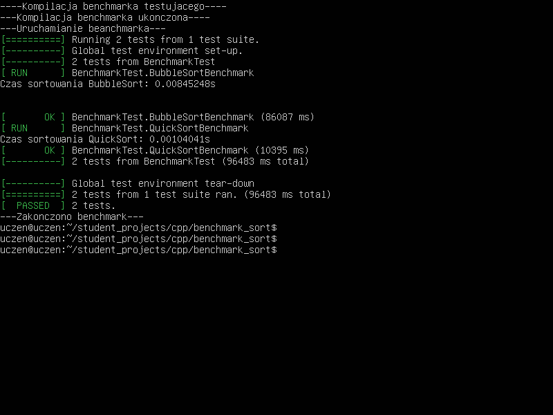

# Benchmark: Porównanie Algorytmów Quicksort i Bubblesort
### Cel Dokumentacji

Celem tej dokumentacji jest przedstawienie szczegółowego porównania dwóch algorytmów sortujących: Bubblesort i Quicksort. Zostaną omówione ich implementacje, właściwości oraz wyniki testów wydajnościowych.
                
### Lista Funkcji
#### 1. Funkcja Bąbelkowa (Bubblesort)

Implementacja klasycznego algorytmu sortowania bąbelkowego. Algorytm ten polega na wielokrotnym przechodzeniu przez listę, porównywaniu sąsiednich elementów i zamienianiu ich miejscami, jeśli są w złej kolejności.

```cpp
  void bubbleSort(std::vector<int>& vec) {
    bool swapped;
    do {
        swapped = false;
        for (size_t i = 0; i < vec.size() - 1; i++) {
            if (vec[i] > vec[i + 1]) {
                std::swap(vec[i], vec[i + 1]);
                swapped = true;
            }
        }
    } while (swapped);
}
```
#### 2. Funkcja Quicksort

Implementacja algorytmu Quicksort, który jest bardziej efektywnym algorytmem sortowania. Działa na zasadzie podziału tablicy na dwie części, a następnie rekurencyjnego sortowania każdej z nich.

```cpp
  void bubbleSort(std::vector<int>& vec) {
    bool swapped;
    do {
        swapped = false;
        for (size_t i = 0; i < vec.size() - 1; i++) {
            if (vec[i] > vec[i + 1]) {
                std::swap(vec[i], vec[i + 1]);
                swapped = true;
            }
        }
    } while (swapped);
}
```
#### 3. Funkcja do Sprawdzania Sortowania

Funkcja, która weryfikuje, czy wektor jest posortowany. Przechodzi przez elementy i sprawdza, czy każdy z nich jest mniejszy lub równy następnemu.

```cpp
  bool isSorted(const std::vector<int>& vec) {
      for (size_t i = 1; i < vec.size(); i++) {
          if (vec[i - 1] > vec[i]) return false;
      }
      return true;
  }
```
#### 4. Testy Wydajnościowe dla Bubblesort

Testy mające na celu zmierzenie czasu wykonania sortowania bąbelkowego. Używają one losowych danych oraz weryfikują, czy wynik sortowania jest poprawny.

```cpp
  TEST(BenchmarkTest, BubbleSortBenchmark) {
    std::vector<int> original(1000);
    std::srand(std::time(0));

    for (int i = 0; i < 10000; i++) {
        std::generate(original.begin(), original.end(), std::rand);
        std::vector<int> vec = original;

        auto start = std::chrono::high_resolution_clock::now();
        bubbleSort(vec);
        auto end = std::chrono::high_resolution_clock::now();

        EXPECT_TRUE(isSorted(vec)) << "BubbleSort failed on iteration " << i;

        std::chrono::duration<double> elapsed_seconds = end - start;
        if (i == 0) { // Print time for the first test only.
            std::cout << "Czas sortowania BubbleSort: " << elapsed_seconds.count() << "s\n";
        }
    }
}
```
#### 5. Testy Wydajnościowe dla Quicksort

Testy mające na celu zmierzenie czasu wykonania algorytmu Quicksort. Procedura jest analogiczna do testów dla sortowania bąbelkowego.

```cpp
  TEST(BenchmarkTest, BubbleSortBenchmark) {
    std::vector<int> original(1000);
    std::srand(std::time(0));

    for (int i = 0; i < 10000; i++) {
        std::generate(original.begin(), original.end(), std::rand);
        std::vector<int> vec = original;

        auto start = std::chrono::high_resolution_clock::now();
        bubbleSort(vec);
        auto end = std::chrono::high_resolution_clock::now();

        EXPECT_TRUE(isSorted(vec)) << "BubbleSort failed on iteration " << i;

        std::chrono::duration<double> elapsed_seconds = end - start;
        if (i == 0) { // Print time for the first test only.
            std::cout << "Czas sortowania BubbleSort: " << elapsed_seconds.count() << "s\n";
        }
    }
}
```
#### Przykład wykonanego kodu



### Podsumowanie Wyników

Z przeprowadzonych testów wynika, że algorytm Quicksort jest znacznie szybszy od Bubblesort. Chociaż Bubblesort jest prostszy do zrozumienia i implementacji, jego złożoność czasowa (O(n²)) czyni go nieefektywnym dla większych zbiorów danych w porównaniu do Quicksort (O(n log n)), który radzi sobie znacznie lepiej z dużymi wektorami.

W praktycznych zastosowaniach, szczególnie przy większych zbiorach danych, zaleca się stosowanie Quicksort lub innych bardziej efektywnych algorytmów sortujących.
