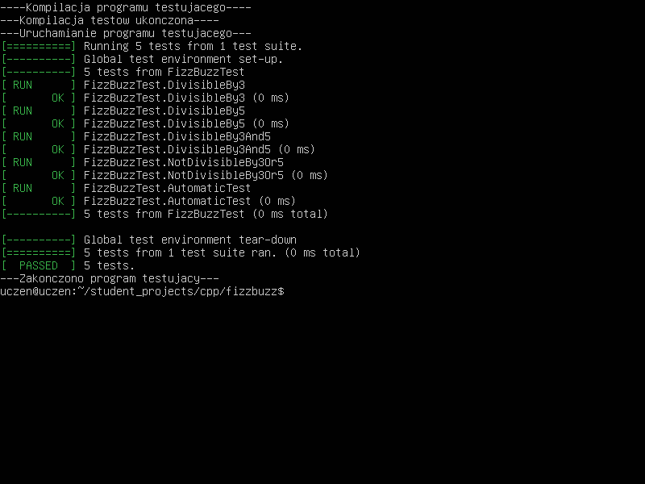

# Dokumentacja FizzBuzz
### Cel Dokumentacji

Celem tej dokumentacji jest przedstawienie implementacji oraz testów funkcji FizzBuzz. Funkcja ta zwraca różne wyniki w zależności od tego, czy liczba jest podzielna przez 3, 5 lub obie te liczby.
                
### Opis Funkcji
#### Funkcja fizzBuzz

Implementacja funkcji FizzBuzz, która sprawdza, czy dana liczba jest podzielna przez 3, 5, lub przez obie te liczby. Zwraca odpowiednie ciągi znaków w zależności od wyniku sprawdzenia.

```cpp
std::string fizzBuzz(int number) {
    if (number % 3 == 0 && number % 5 == 0) {
        return "FizzBuzz";
    } else if (number % 3 == 0) {
        return "Fizz";
    } else if (number % 5 == 0) {
        return "Buzz";
    } else {
        return std::to_string(number);
    }
}
```
### Testy

Testy sprawdzają poprawność działania funkcji FizzBuzz w różnych scenariuszach. Poniżej przedstawiono szczegółowe opisy poszczególnych testów.

#### 1. Test dla Liczb Podzielnych przez 3

Pierwszy test sprawdza, czy liczby podzielne przez 3 zwracają spodziewany wynik "Fizz".

```cpp
TEST(FizzBuzzTest, DivisibleBy3) {
    EXPECT_EQ(fizzBuzz(3), "Fizz");
    EXPECT_EQ(fizzBuzz(6), "Fizz");
    EXPECT_EQ(fizzBuzz(9), "Fizz");
}
```
#### 2. Test dla Liczb Podzielnych przez 5

Drugi test weryfikuje, czy liczby podzielne przez 5 zwracają spodziewany wynik "Buzz".

```cpp
TEST(FizzBuzzTest, DivisibleBy5) {
    EXPECT_EQ(fizzBuzz(5), "Buzz");
    EXPECT_EQ(fizzBuzz(10), "Buzz");
    EXPECT_EQ(fizzBuzz(20), "Buzz");
}
```
#### 3. Test dla Liczb Podzielnych przez 3 i 5

Trzeci test sprawdza, czy liczby podzielne zarówno przez 3, jak i 5 zwracają wynik "FizzBuzz".

```cpp
TEST(FizzBuzzTest, DivisibleBy3And5) {
    EXPECT_EQ(fizzBuzz(15), "FizzBuzz");
    EXPECT_EQ(fizzBuzz(30), "FizzBuzz");
    EXPECT_EQ(fizzBuzz(45), "FizzBuzz");
}
```
#### 4. Test dla Liczb Niepodzielnych przez 3 i 5

Czwarty test sprawdza, czy liczby, które nie są podzielne ani przez 3, ani przez 5, zwracają swoje wartości jako ciągi znaków.

```cpp
TEST(FizzBuzzTest, NotDivisibleBy3Or5) {
    EXPECT_EQ(fizzBuzz(1), "1");
    EXPECT_EQ(fizzBuzz(2), "2");
    EXPECT_EQ(fizzBuzz(4), "4");
}
```

#### 5. Test Automatyczny

Piąty test łączy wszystkie powyższe testy w jeden zautomatyzowany proces, który weryfikuje działanie funkcji dla wszystkich liczb od 1 do 100.

```cpp
TEST(FizzBuzzTest, AutomaticTest) {
    for (int i = 1; i <= 100; ++i) {
        std::string expected;
        if (i % 3 == 0 && i % 5 == 0) {
            expected = "FizzBuzz";
        } else if (i % 3 == 0) {
            expected = "Fizz";
        } else if (i % 5 == 0) {
            expected = "Buzz";
        } else {
            expected = std::to_string(i);
        }
        EXPECT_EQ(fizzBuzz(i), expected) << "Failed for number: " << i;
    }
}
```

### Podsumowanie

Funkcja FizzBuzz przeszła wszystkie testy, co potwierdza jej skuteczność i brak błędów. Dzięki różnorodnym testom funkcja została zweryfikowana pod kątem wszystkich możliwych przypadków, co świadczy o jej niezawodności.

### Przykład Wykonanego Kodu

Kod został skutecznie przetestowany i działa zgodnie z oczekiwaniami, zwracając prawidłowe wyniki dla każdego testowanego przypadku.

