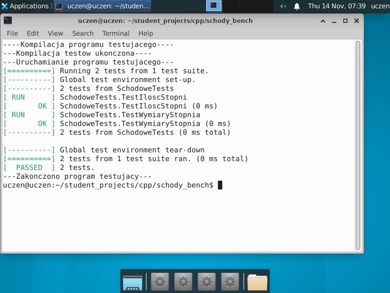
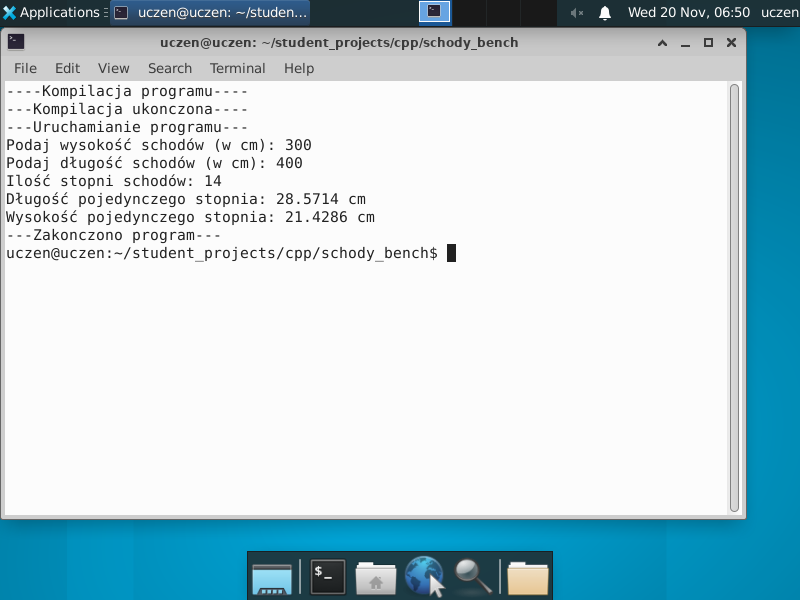

# Dokumentacja Programu do Obliczania Schodów

### Cel Dokumentacji

Celem tej dokumentacji jest przedstawienie szczegółów implementacji programu, który oblicza liczbę stopni schodów na podstawie podanych przez użytkownika wymiarów schodów (wysokość i długość), a także szczegółowe wymiary każdego stopnia. Dokumentacja obejmuje również opis testów jednostkowych, które weryfikują poprawność działania programu.

---

## Opis Funkcji

### 1. `obliczIloscStopni`

Funkcja `obliczIloscStopni` oblicza maksymalną liczbę stopni, która może być wygenerowana na podstawie wymiarów schodów podanych przez użytkownika, przy czym każdy stopień ma spełniać minimalne i maksymalne wymagania dotyczące wysokości i długości.

```cpp
double obliczIloscStopni(double wysokosc, double dlugosc) {
    const double minWysokosc = 15.0;
    const double maxWysokosc = 17.0;
    const double minDlugosc = 28.0;
    const double maxDlugosc = 30.0;

    int iloscStopniWysokosc = std::floor(wysokosc / maxWysokosc);
    int iloscStopniDlugosc = std::floor(dlugosc / minDlugosc);

    if (iloscStopniWysokosc <= 0 || iloscStopniDlugosc <= 0) {
        return -1;  // Wartość -1 oznacza, że schody nie mogą być wygenerowane
    }

    return std::min(iloscStopniWysokosc, iloscStopniDlugosc);
}

```

- **Parametry**:
  - `wysokosc` - całkowita wysokość schodów w centymetrach (double).
  - `dlugosc` - całkowita długość schodów w centymetrach (double).

- **Zwracana wartość**:
  - Zwraca liczbę stopni jako wartość całkowitą (int), która spełnia wymagania minimalnych wymiarów stopni. 
  - Jeśli wymiary są zbyt małe, zwraca wartość `-1`, co oznacza brak możliwości wygenerowania schodów.

---

### 2. `obliczWymiaryStopnia`

Funkcja `obliczWymiaryStopnia` oblicza szczegółowe wymiary pojedynczego stopnia na podstawie całkowitych wymiarów schodów oraz liczby stopni wygenerowanej przez `obliczIloscStopni`.

```cpp
//kod

void obliczWymiaryStopnia(double dlugosc, double wysokosc, int iloscStopni, double& dlugoscStopnia, double& wysokoscStopnia) {
    dlugoscStopnia = dlugosc / iloscStopni;
    wysokoscStopnia = wysokosc / iloscStopni;
}
```

- **Parametry**:
  - `dlugosc` - całkowita długość schodów w centymetrach (double).
  - `wysokosc` - całkowita wysokość schodów w centymetrach (double).
  - `iloscStopni` - liczba stopni wygenerowana przez funkcję `obliczIloscStopni` (int).
  - `dlugoscStopnia` - referencja do zmiennej przechowującej długość pojedynczego stopnia (double).
  - `wysokoscStopnia` - referencja do zmiennej przechowującej wysokość pojedynczego stopnia (double).

- **Opis działania**:
  Funkcja dzieli długość i wysokość schodów przez liczbę stopni, uzyskując wymiary każdego stopnia osobno.

---

### 3. `wprowadzenieWymiarow`

Funkcja `wprowadzenieWymiarow` pobiera od użytkownika wysokość i długość schodów.

```cpp
//kod
void wprowadzenieWymiarow(double& wysokosc, double& dlugosc) {
    std::cout << "Podaj wysokość schodów (w cm): ";
    std::cin >> wysokosc;
    std::cout << "Podaj długość schodów (w cm): ";
    std::cin >> dlugosc;
}
```

- **Parametry**:
  - `wysokosc` - referencja do zmiennej przechowującej wartość wysokości schodów w centymetrach (double).
  - `dlugosc` - referencja do zmiennej przechowującej wartość długości schodów w centymetrach (double).

- **Opis działania**:
  Funkcja wyświetla komunikaty dla użytkownika i zapisuje wprowadzone wartości w odpowiednich zmiennych.

---

## Plik `main.cpp`

Główna logika programu znajduje się w `main.cpp`, gdzie wykonywane są operacje pobierania danych od użytkownika, obliczania liczby stopni, a także wyświetlania wymiarów każdego stopnia.

```cpp
int main() {
    double wysokosc, dlugosc;
    wprowadzenieWymiarow(wysokosc, dlugosc);

    double iloscStopni = obliczIloscStopni(wysokosc, dlugosc);
    if (iloscStopni < 0) {
        std::cout << "Wprowadzone wymiary nie pozwalają na wygenerowanie schodów." << std::endl;
        return 1;
    }

    double dlugoscStopnia, wysokoscStopnia;
    obliczWymiaryStopnia(dlugosc, wysokosc, iloscStopni, dlugoscStopnia, wysokoscStopnia);

    std::cout << "Ilość stopni schodów: " << iloscStopni << std::endl;
    std::cout << "Długość pojedynczego stopnia: " << dlugoscStopnia << " cm" << std::endl;
    std::cout << "Wysokość pojedynczego stopnia: " << wysokoscStopnia << " cm" << std::endl;

    return 0;
}
```

---
## Przykład działania programu dla różnych liczb

| Wysokość schodów (cm) | Długość schodów (cm) | Liczba stopni | Długość pojedynczego stopnia (cm) | Wysokość pojedynczego stopnia (cm) |
|------------------------|----------------------|---------------|------------------------------------|-------------------------------------|
| 300                    | 400                  | 14            | 28.57                             | 21.43                               |
| 200                    | 350                  | 10            | 35.0                              | 20.0                                |
| 150                    | 280                  | 7             | 40.0                              | 21.43                               |
| 30                     | 60                   | 2             | 30.0                              | 15.0                                |
| 15                     | 30                   | 1             | 30.0                              | 15.0                                |

#### Wyjaśnienia do tabelki:
- **Wysokość schodów (cm)**: Całkowita wysokość, jaką mają mieć schody.
- **Długość schodów (cm)**: Całkowita długość schodów.
- **Liczba stopni**: Obliczona liczba stopni na podstawie minimalnych wymiarów schodów.
- **Długość pojedynczego stopnia (cm)**: Długość stopnia po podziale całkowitej długości przez liczbę stopni.
- **Wysokość pojedynczego stopnia (cm)**: Obliczona wysokość pojedynczego stopnia na podstawie całkowitej wysokości schodów i liczby stopni, dopasowana do proporcji schodów.
---

## Testy

Testy jednostkowe sprawdzają, czy funkcje `obliczIloscStopni` i `obliczWymiaryStopnia` działają zgodnie z założeniami programu. Testy znajdują się w pliku `main_test.cpp`.

### Testy do `obliczIloscStopni`

Testy funkcji `obliczIloscStopni` sprawdzają poprawność obliczeń liczby stopni przy różnych wartościach wysokości i długości schodów, a także reakcję funkcji na wartości niemożliwe do przetworzenia.

```cpp
TEST(SchodoweTests, TestIloscStopni) {
    EXPECT_EQ(obliczIloscStopni(300, 400), 14);
    EXPECT_EQ(obliczIloscStopni(30.0, 60.0), 2);
    EXPECT_EQ(obliczIloscStopni(15.0, 30.0), 1);
}
```

### Testy do `obliczWymiaryStopnia`

Testy funkcji `obliczWymiaryStopnia` weryfikują poprawność obliczeń długości i wysokości pojedynczego stopnia na podstawie liczby stopni oraz całkowitych wymiarów schodów.

```cpp
TEST(SchodoweTests, TestWymiaryStopnia) {
    double dlugoscStopnia, wysokoscStopnia;
    obliczWymiaryStopnia(100.0, 60.0, 4, dlugoscStopnia, wysokoscStopnia);

    EXPECT_DOUBLE_EQ(dlugoscStopnia, 25.0);
    EXPECT_DOUBLE_EQ(wysokoscStopnia, 15.0);
}
```
## Podsumowanie
Kod został skutecznie przetestowany i działa zgodnie z oczekiwaniami, zwracając prawidłowe wyniki dla każdego testowanego przypadku.


---



Program do obliczania schodów pozwala użytkownikowi wprowadzić wymiary schodów i oblicza szczegółowe dane o liczbie i wymiarach stopni. Program został przetestowany przy użyciu testów jednostkowych, co zapewnia poprawność działania w szerokim zakresie wartości, w tym przy wartościach niemożliwych do przetworzenia.
